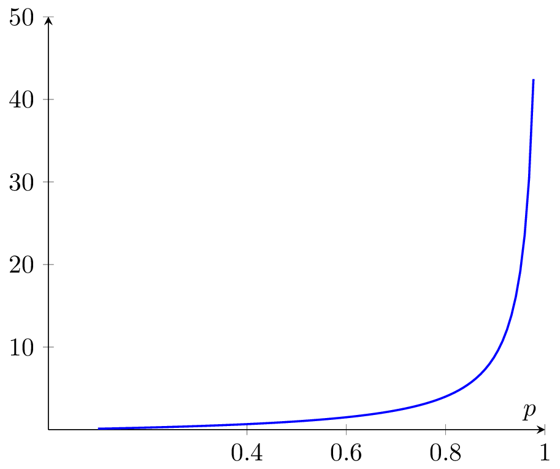
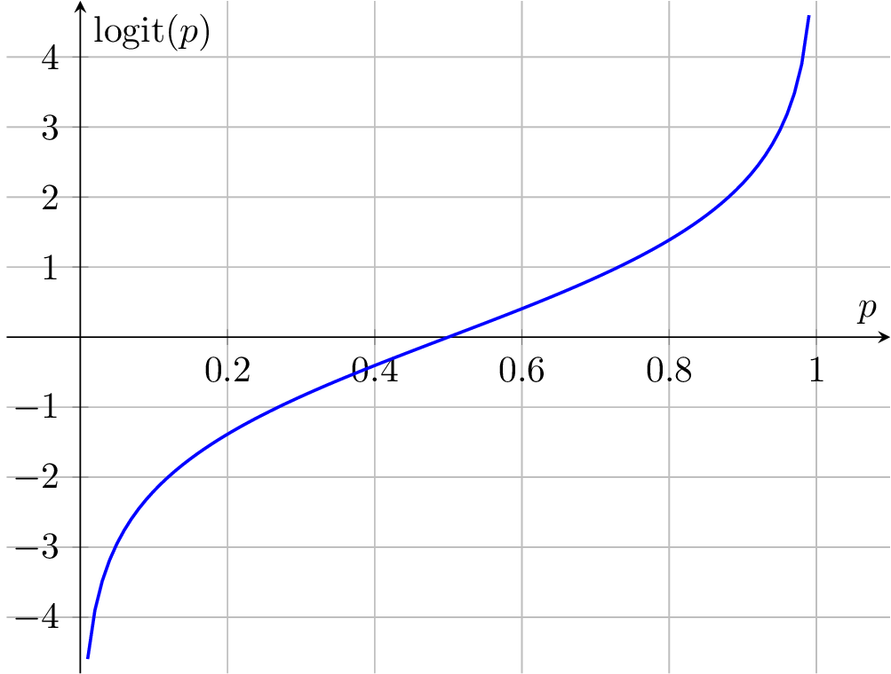
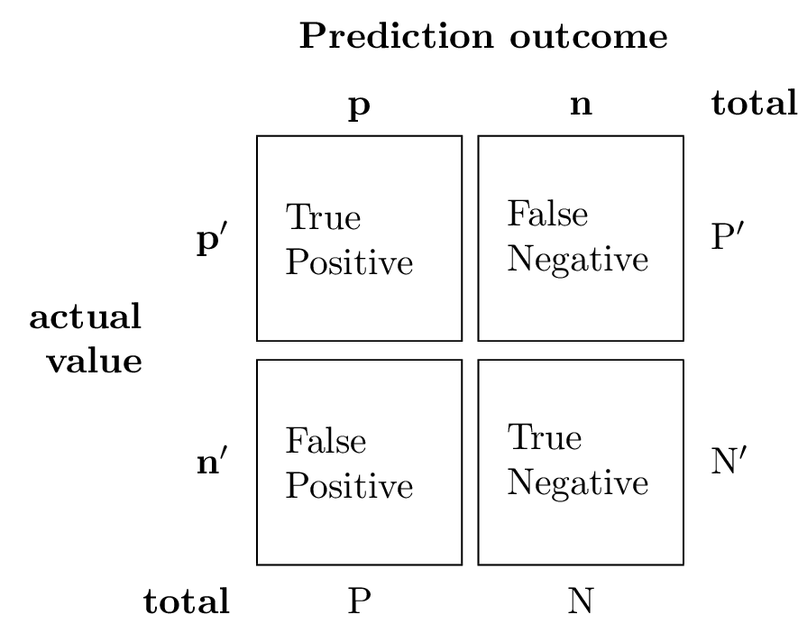

# Past exam questions

## Hoeffdings inequality (describe the elements and the objective)
<!-- 
How do we know if we are approaching the target function?

In the case of red and green marbles there is one true proportion of marbles. $\mu$ is the proportion of red marbles.

If we start sampling marbles from the bin, $\nu$ is the proportion of red marbles withing the sample.
According to the law of large numbers if we repeat the sampling infinite time, $\nu$ will be equal to the true value $\mu$

We know that $\mu$ is in the range $[0,1]$, so far we found a certain value of $\nu$ with $n$ samples. We set a threshold $\epsilon$ and we want to know how far $\nu$ is from $\mu$.

$$
|\mu - \nu| > \epsilon
$$

If the distance is greater than $\epsilon$ it means that we are not close to the true value.

We want this probability to be as small as possible:
$$
P(|\mu - \nu| > \epsilon) < 2Me^{-2\epsilon^2N}
$$

As we increase the number of samples the quantity becomes small which in turn means the accuracy increases. -->

Let $Z_1, \dots , Z_2$ be $n$ indipendent and indentically distributed (iid) random variables drawn from a Beronoulli ($\phi$) distribution.
I.e. $P(Z_i = 1) = \phi$ and $P(Z_i = 0) = 1 - \phi$.

Let $\hat\phi = {1\over n} \sum_{i = 1}^n Z_i$ be the mean of these random variables, and let any $\epsilon > 0$ be fixed. Then:
$$
P(|\phi - \hat\phi| > \epsilon) \le 2 e^{(-2\epsilon^2n)}
$$

This lemma, also known in learning theory as the *Chernoff bound*, says that if we take $\hat\phi$ (the average of $n$ Bernoulli($\phi$) random variables) to be our estimate of $\phi$, then the probability of us being far from the true value is small, as long as $n$ is large. Another way of saying this is that if you have a biased coin whose chance of landing on heads is $\phi$, then if you toss it $n$ times and calculate the fraction of times that it came up heads, that will be a good estimate of $\phi$ with high probability (if $n$ is sufficiently large).

## What does machine learning mean?

There are two definitions of learning:

- Learning is the acquisition of knowledge about the world
- Learning is an adaptive change in behaviour caused by experience

## Explain the gradient descent algorithm

The gradient of a differentiable function $f: \mathbb{R}^n \rightarrow \mathbb{R}$ at $w$, denoted by $\nabla f(w)$, is the vector of the partial derivatives of $f$ at $w$:

$$
\nabla f(w) = \left( \frac{\partial f(w)}{\partial w_1}, \dots, \frac{\partial f(w)}{\partial w_n} \right)
$$

Gradient descent is an iterative algorithm, we start with an initial value of $w$, then, at each iteration, we take a step in the direction negative of the gradient at the current point:
$$
\text{Update rule: } w^{i + 1} = w^i - \eta \nabla f(w^i)
$$

where $\eta$ is the learning rate, a positive scalar that determines the size of the step we take, a high value of $\eta$ can lead to faster convergenge but can also cause the algorithm to overshoot the minimum.

Intuitively, the gradient points in the direction of the steepest increase of the function, so by moving in the opposite direction we are moving towards the minimum of the function.

After $T$ iterations, the algorithm outputs the averaged vector:
$$
\bar{w} = \frac{1}{T} \sum_{i = 1}^T w^i
$$
The algorithm is not guaranteed to converge to an optimal solution, it can get stuck in a local minimum or a saddle point.

## Explain the Perceptron Learning Algorithm (PLA)

The Perceptron is an algorithm for learning a binary classifier called a threshold function: a functions that maps it input $x$ to an ouput value $f(x)$

{ width=250}

Key components:

- Input nodes $x_1, \dots, x_n$: the primary component that accepts initial input data into the model. Each input node contains a real numerical value.
- Weights $w_i$: The weight parameter represents the strenght of the connection between units.
- Activation function: the final and essential component that helps determine whethere the neurone will fire or not. In the perceptron the activation function is the sign function.

The perceptron hypothesis is:
$$
h(x) = w_1x_1 + \cdots + w_nx_n = \sum_{i =1}^N w_ix_i
$$

given that the perceptron only fires above a certain threshold, we can rewrite the hypothesis as follows:
$$h(x) = \text{sign} \left( \sum_{i = 1}^N w_ix_i - \text{threshold} \right)
$$

WE can simplify this expression further by arguing that the threshold is equivalent to the bias term $w_0$: if we have some (activation) function $\phi: \mathbb{R} \to \mathbb{R}$ then $\phi(x - b)$ will be the graph of $\phi$ shifted to the right by $b$ units. Therefore, we can rewrite the hypothesis as:
$$
h(x) = \text{sign} \left( \sum_{i = 0}^N w_ix_i \right)
$$
Note the $i=0$

The PLA is used to train a perceptron to classify input patterns into one of two classes, the training process involes:

1. Initialization: initialize the weights and bias randomly
2. Forwar pass: calculate the output using the current weight and bias
3. Error evaluation: calculate the error between the predicted output and the actual output.
4. Weight update: update the weights and bias using the error and the input values.

The learning rule is:
$$
w_\text{new} = w_\text{old} + x_iy_i
$$
Note that the update is only applied when the predicted output is incorrect.

Limitations:

- Linearly separable data: the perceptron model is limited to learning linearly separable patterns (it cannot learn the XOR)
- Requires labeled data: the perceptron requires labeled data to learn the weights and bias

## Explaing the logistic regression model

The Perceptron and Adeline cannot estimate the probability that a point belongs to class.
Logistic regression can be used to solve this problem.
In logisitc regression we learn a family of function $h: \mathbb{R}^d \to [0,1]$, which is used for classifications tasks: we can interpret the output of the model as the probability that a point belongs to class 1.

The hypothesis class associated with logistic regression is the composition of *sigmoid* function $\sigma: \mathbb{R} \to [0,1]$ over the class of linear functions $L_d$.
In particular the sigmoid function used in logistic regression is the logistic function:
$$
\sigma(z) = \frac{1}{1 + e^{-z}}
$$

In a binary classification problem, let $p$ be the probability of the positive class, the odds is defined as the ratio between the probability of the positive class and the probability of the negative class:
$$
\text{odds} = \frac{p}{1-p}
$$

{ width=250px }

We can define the logit function as the logarithm of the odds, also called log-odds we obtain:
$$
\text{logit}(p) = \ln \left( \frac{p}{1-p} \right)
$$

this trasnformation of the logit functions maps a value in the range $[0,1]$ to $\mathbb{R}$:

{ width=250px }

If $p$ is the probability that an object $x$ is classified in the positive class, that is $p(y = 1 |x)$,  then we can use this to express a linear relationship between the loit function and the values of the input $x$:
$$
\text{logit}(p(y = 1 | x)) = w_0x_0 + w_1x_1 + \cdots + w_dx_d = \sum_{i = 0}^d w_ix_i = w^Tx = z
$$
Since we are interested in the probability of $p(y = 1 | x)$ (not in its logit  transformation), we can write the inverse of the logit function as:
$$
z = ln \left( \frac{p}{1-p} \right) \Rightarrow p = \frac{1}{1 + e^{-z}}
$$
The resulting function is the logistic sigmoid function:
$$
\sigma(z) = \frac{1}{1 + e^{-z}}
$$

We can then plug the sigmoid fucntion at the output of a perceptron to obtain the probability that the object $x$ belongs to the positive class:
$$
h(x) = \sigma(w^Tx) = \frac{1}{1 + e^{-w^Tx}}
$$

## Proof of the perceptron convergence theorem

$$
\begin{aligned}
&k \gets 1; w_k \gets 0\\
&\text{while } \exists i \in \{1, \dots, n\} \text{ s.t. } y^i(w_k \cdot x^i) \le 0 \text{ do} \\
&\quad w_{k+1} \gets w_k + y^i x^i\\
&\quad k \gets k + 1\\
&\text{end while}\\
&\text{return } w_k
\end{aligned}
$$

The algorithm maintains a weight vector, initially the zero vector. At each iteration, the algorithm checks if there is a misclassified point, and if so, it updates the weight vector by adding the misclassified point to it. The algorithm terminates when there are no more misclassified points.

**Theorem**: The Perceptron Learning Algorithm makes at most $R^2/\gamma^2$ updates before converging.

*Proof*:

- It is immediate from the code that should the algorithm terminate and return a weight vector, then the weight vector must separate the data points.
- Thus it's suffices to show that the algorithm terminates after at most $R^2/\gamma^2$ updates.

In other words we need to show that $k$ is upper-bounded by $R^2/\gamma^2$:

Note that $w^1 = 0$ and for $k \ge 1$, note that if $x^j$ is misclassified during iteration $k$ we have:
$$
\begin{aligned}
w^{k + 1} \cdot w^* &= (w^k + y^j x^j) \cdot w^*\\
&= w^k \cdot w^* + y^j x^j \cdot w^*\\
&= w^k \cdot w^* + y^j \gamma\\
\end{aligned}
$$
It follows by induction that $w^{k + 1} \cdot w^* = k \gamma$. Since $w^{k+1} \cdot w^* \le ||w^{k+1}|| \cdot ||w^*|| = ||w^{k+1}||$, we get:
$$
||w^{k+1}|| >k \gamma
$$
To obtain an upperbound we argue that:
$$
\begin{aligned}
||w^{k+1}||^2 &= ||w^k + y^ix^i||^2 \\
&= ||w^k||^2 ||y^ix^i||^2 + 2(w^k \cdot x^i)y^i\\
&= ||w^k||^2 + 2(w^k \cdot x^i)y^i + ||x^i||^2\\
&\le ||w^k||^2 + ||x^j||^2\\
&\le kR^2
\end{aligned}
$$
from which it follows by induction that:
$$
||w^{k+1}||^2 \le kR^2
$$
Thus we have:
$$
k^2 \gamma^2 \le ||w^{k+1}||^2 \le kR^2
$$
which implies :
$$
k < R^2/\gamma^2
$$

## Evaluation of classifiers

A confusion matrix is a table which for a more detailed analysis compared to simply observing the proportion of correct classifications (accuracy).

Accuracy yields misleading results if the dataset is unbalanced.

For example, if there are 95 negative cases and 5 positive cases, a classifier that predicts all negative cases will have an accuracy of 95%, but it is not a good classifier.

The confusion matrix is a 2x2 matrix that contains the following values:

- True positive (TP): the number of positive cases that were correctly classified as positive
- False positive (FP): the number of negative cases that were incorrectly classified as positive
- True negative (TN): the number of negative cases that were correctly classified as negative
- False negative (FN): the number of positive cases that were incorrectly classified as negative

{ width=250px }

$$
\text{accuracy} = \frac{TP + TN}{TP + TN + FP + FN}
$$

Accuracy is high if the largest calss is classified correctly, we can pair accuracy with a more  usefuls metric:

- Precision: the proportion of true pisitives among all positive predictions made by the model. Precision indicates what the proporing of positive predictions made by the model are actually correct.
  $$
  \text{precision} = \frac{TP}{TP + FP}
  $$
- Recall: the proportion of true positives among all actual positive instances in the dataset. Recall indicates what proportion of the actual positive instances in the dataset were correctly classified by the model.
  $$
  \text{recall} = \frac{TP}{TP + FN}
  $$

The objective is to have high accuracy and high precision at the same time.
$F_1$ is a weighted value between recall and precision:
$$
F_1 = \frac{2 PPV \cdot TPR}{PPV + TPR}
$$
where:

- $PPV$ is the positive predictive value (precision)
- $TPR$ is the true positive rate (recall)

## Hold out approach vs cross-validation, explain the differences

In the hold out approach the dataset is divided into two parts:

- a training set
- a test set (or hod out set)

The training set is used to train the model, while the test set is used to evaluate its performance.
The main issues of this approach are:

- Data size limitation: the size of the test set can be small, which may not provide a representative sample of the data
- Data selection sensitivityL the performance mtrics can be sensitive to the specific data points selected for the test set.
- Overfitting: the model may still drift to defit the training data, especially if the test set is small.

Cross-validation approach is a more robust method for model evaluation:

- it involves dividing the dataset into $k$ equal parts or folds.
- For each fold, the model is trained on all the data except the current fold, and the evaluated on the current fold.

By using multiple folds, the variance in the performance metrics is reduced providing a more accurate estimate of the model's performance.

A common variate of the cross-validation test is the $k$-fold cross validation where the dataset is divided into $k$ folds and the model is trained and evaluated on each fold.

## Starting from the definition of the in-sample error transofrm it into its matrix form

Given:

- $h$: our hypothesis
- $E_{in}(h)$L the in-sample error of $h$ , $E_\text{in} = \frac{1}{N} \sum_{i = 1}^N (h(x_i) - y_i)^2$

$$
w_i = \begin{bmatrix}
  w_0\\
  w_1\\
  \vdots\\
  w_d
\end{bmatrix}
\quad
x_i = \begin{bmatrix}
  1\\
  x_{1}\\
  \vdots\\
  x_{d}
\end{bmatrix}\\
\implies
E_\text{in}(w) = \frac{1}{N} ||x_w - y||^2\\
\quad
x = \begin{bmatrix}
  - x_1^T -\\
  - x_2^T - \\
  \vdots  \\
  - x_N^T -
\end{bmatrix}
\quad
y = \begin{bmatrix}
  y_1 \\
  y_2 \\
  \vdots \\
  y_N
\end{bmatrix}
$$

## Explain model evaluation using the Wilcoxon signed-rank test

Given two models, like a KNN with $k = 1$ and a KNN with $k = 5$, how can we determine which one is better?

We can use pairing, which consists of organizing training samples into matched pairs, and see how the experiments make the model perform.

{ width=250px }

Using the same train-test split:
$$
\begin{aligned}
  &\text{ex}_1 &\text{Train}_1 &\quad\text{Test}_1 \\
  &\text{ex}_2 &\text{Train}_2 &\quad\text{Test}_2 \\
  &\dots & \dots &\quad \dots
\end{aligned}
$$

How can we determine which model performs better? Is the difference between the two models due to chance, or is it statistically significant?

Let's assume that the points are distributed like a gaussian distribution. If the difference between the models is constantly far from the mean, then the difference is statistically significant.

{ width=250px }

$A_1 + A_2 = 5\%$ of the total distribution, this percentage is called **$\alpha$-value**
The $p$-value is the probability of observing the specific sequence of differences in the experiments.
$\alpha$ is a predetermined threshold for determining the significance of a result, while the $p$-value is the probability is the probability that helps decide whether the null hypothesis can be rejected on based on that threshold.

$$
L_D(h) \le L_s(h) + \sqrt{C \frac{d + \log(1 /\delta)}{m}}
$$
where:

- $L_D(h)$: Loss on what will happen outside of the training sample, out of sample error
- $L_s(h)$: Loss on the sample, in-sample error
- $m$: the number of datapoints
- $d$: is the VC dimension of the perceptron ($d= 3$)
If we have a simpler and a more complex model, both with in-sample-error $s$ ,the more complex model will be less precise in the out-of-sample error given it's structure (less precise $\implies$ higher variance).

An analogous thing can be argued for the validation test:
$$
L_D(h) \le L_s(h) + \sqrt{\frac{\log(1 /\delta)}{2mv}}
$$

{ width=250px }
