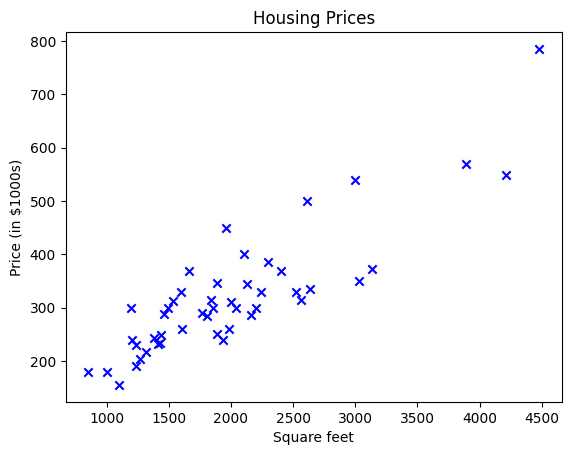
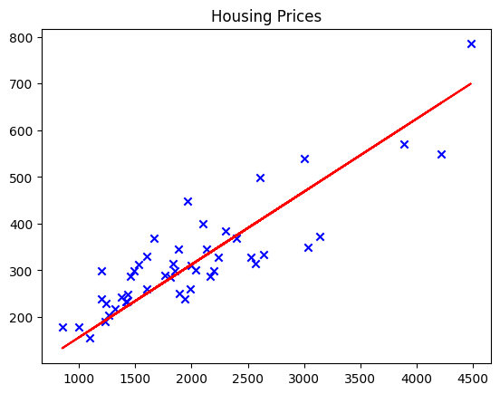
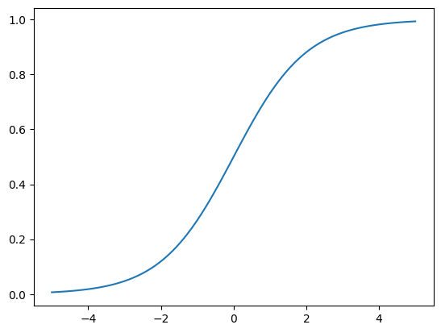
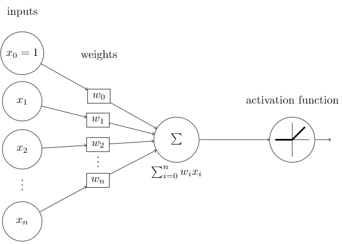
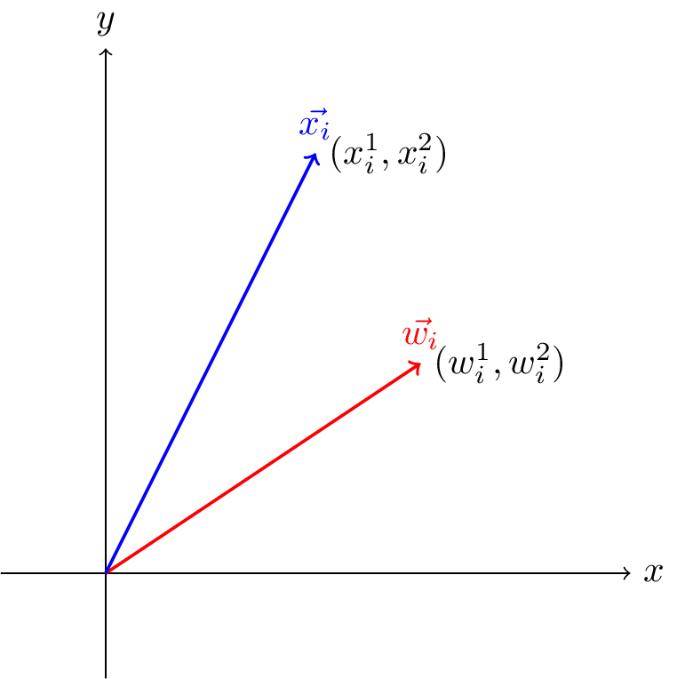
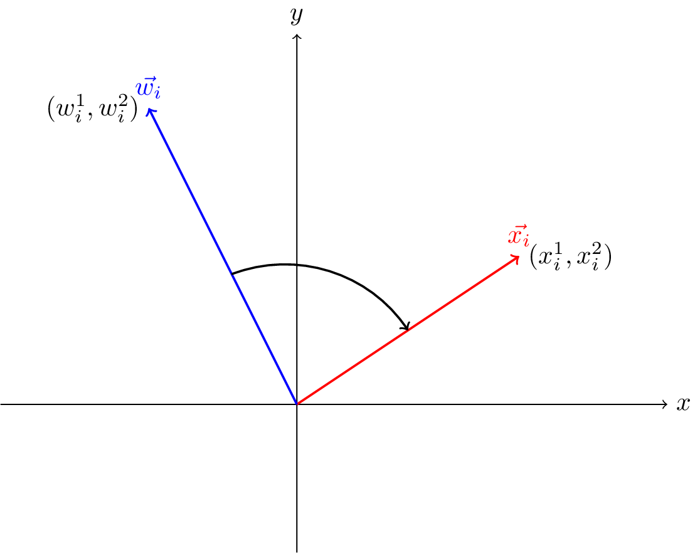
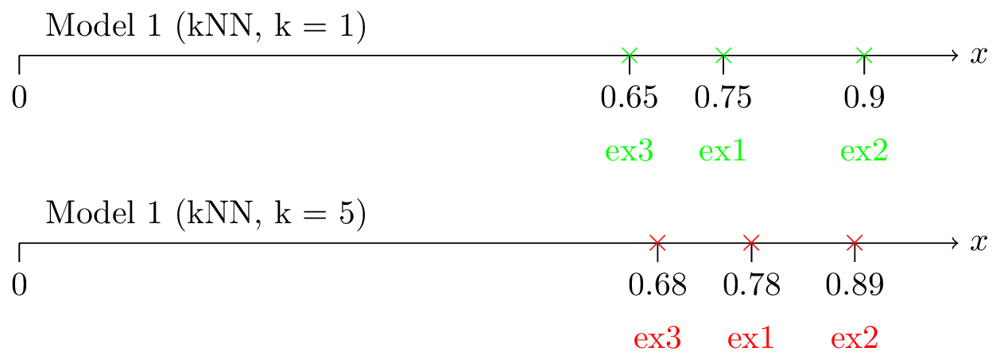
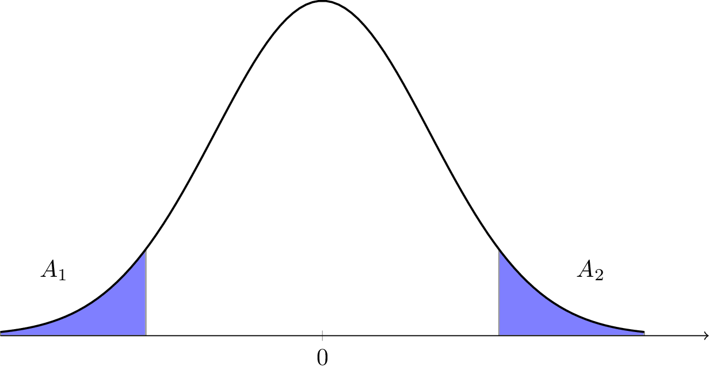
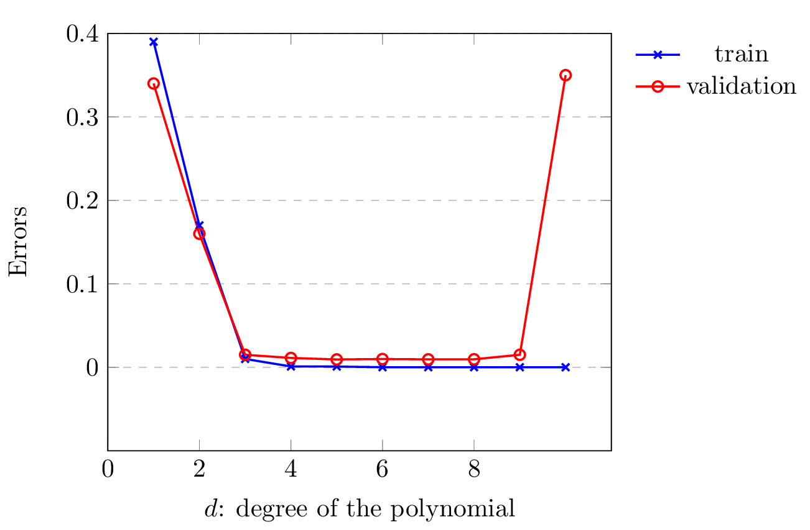

---
title: "Introduction to Machine Learning"
author: [Mouhieddine Sabir]
date: "2024-07-15"
subject: "Machine Learning"
keywords: [Machine Learning]
lang: "en"
titlepage: true
...

> Disclaimer:
>
> These notes are roughly based on the lectures of professor Di Nunzio for the course "Introduction to machine learning" at the University of Padova.
> In my opinion, the course lacks an in-depth explanation of the topics, in these notes I try to fill the gaps with my understanding of the topics.
> I'm not a machine learning expert, so take these notes with a grain of salt.
> The order of the topics is not the same as the course, I tried to group the topics in a more logical way.
> At the end of the document there is an appendix with the theoretical questions that the professor might ask during the exam.

# Introduction to Machine Learning

# Supervised Learning

Let's start by showing a few examples of supervised learning problems.
Suppose we have a dataset giving the living areas and prices of 47 houses from Padova, Italy.

| Living area (m²) | Price (€) |
|------------------|-----------|
|2104 | 400|
|1600 | 330|
|2400 | 369|
|1416 | 232|
|3000 | 540|

We can plot this data: the x-axis represents the living area, and the y-axis represents the price.

Given data like this, how can we learn to predict the prices of other houses in Padova, as a function of the size of their living areas?

**Notation and Definitions:**

1. **Input Variables (Features)**: Denoted by $x^{(i)}$, where $x$ represents the living area of the house.
2. **Output Variable (Target)**: Denoted by $y^{(i)}$, where $y$ represents the price of the house.
3. **Training Example**: A pair $(x^{(i)}, y^{(i)})$, which consists of the living area and the corresponding house price.
4. **Training Set**: A list of $ n $ training examples $\{(x^{(i)}, y^{(i)}); i = 1, \ldots, n\}$. This dataset is used to learn the relationship between living area and house price.
5. **Input Space (X)**: The space of input values, which in this case is the set of all possible living area values.
6. **Output Space (Y)**: The space of output values, which in this case is the set of all possible house prices.
7. **Hypothesis (h)**: A function $h: X \rightarrow Y$ that maps input values (living areas) to predicted output values (prices).

**Supervised Learning Problem:**

- **Goal**: Given a training set, the goal is to learn a hypothesis $h$ that can predict house prices accurately based on their living areas.
- **Process**:
  - **Training Set**: Collect data pairs of living areas and house prices.
  - **Learning Algorithm**: Use the training set to develop a hypothesis $h$.
  - **Prediction**: Use the hypothesis $h$ to predict house prices for new, unseen living areas.

**Types of Learning Problems:**

1. **Regression Problem**: When the target variable $y$ is continuous (e.g., predicting house prices).
2. **Classification Problem**: When $y$ can take on a small number of discrete values (e.g., predicting if a dwelling is a house or an apartment based on living area).

## Linear regression

To make the housing example more interesting, let's consider a more complex dataset that includes additional features such as the number of bedrooms in the house.

| Living area (m²) | Number of bedrooms | Price (€) |
|------------------|--------------------|-----------|
|2104 | 3 | 400|
|1600 | 3 | 330|
|2400 | 3 | 369|
|1416 | 2 | 232|
|3000 | 4 | 540|
| $\vdots$| $\vdots$ | $\vdots$|

**Input Variables (Features)**:

- $x_1^{(i)}$: Living area of the $i$-th house.
- $x_2^{(i)}$: Number of bedrooms in the $i$-th house.
- Together, $x^{(i)} = [x_1^{(i)}, x_2^{(i)}]$ forms a 2-dimensional vector in $\mathbb{R}^2$.

**Output Variable (Target)**:

- $y^{(i)}$: Price of the $i$-th house.

**Training Example**:

- A pair $(x^{(i)}, y^{(i)})$, where $x^{(i)}$ is the feature vector and $y^{(i)}$ is the corresponding price.

**Training Set**:

- A list of $ n $ training examples $\{(x^{(i)}, y^{(i)}); i = 1, \ldots, n\}$.

**Input Space (X)**:

- The space of input values, which is now $\mathbb{R}^2$ (since each input is a 2-dimensional vector).

**Output Space (Y)**:

- The space of output values, which remains $\mathbb{R}$.

**Hypothesis (h)**:

- A function $h: X \rightarrow Y$ that maps input vectors (living area and number of bedrooms) to predicted output values (prices).

To perform supervide learning, we must decide how to represent the hypothesis $h$. As an initial choice, let's say we decide to approximate $h$ as a linear function of the form:
$$
h_\theta(x) = \theta_0 + \theta_1 x_1 + \theta_2 x_2
$$
where:

- $x = [x_1, x_2]$ is the input feature vector.
- $\theta = [\theta_0, \theta_1, \theta_2]$ are the parameters of the model, also known as the weights.

When there is no risk of confusion, we can drop the subscript $\theta$ and write $h(x)$ instead of $h_\theta(x)$. To simplify further the notation, we define the intercept term $x_0 = 1$, so that the hypothesis becomes:
$$
h(x) = \theta_0 x_0 + \theta_1 x_1 + \theta_2 x_2 = \sum_{j=0}^{d} \theta_j x_j = \theta^T x
$$
where $d$ is the number of input features (not counting $x_0$), $\theta = [\theta_0, \theta_1, \theta_2]$ and $x = [x_0, x_1, x_2]$.

Now, given a training set, how do we pick, or *learn*, the parameters $\theta$ of the model?

One reasonable guess is to make $ h(x) $ close to $ y $ for our training examples, at least for most of them. To formalize this, we define a function that measures how well a given hypothesis $ h $ fits the training data. This function is called the **cost function** or **loss function**, and is defined as follows:
$$
J(\theta) = \frac{1}{2} \sum_{i=1}^{n} (h(x^{(i)}) - y^{(i)})^2
$$
This function is most known as the **least-squares cost function** and it gives rise to the **ordinary least squares (OLS)** regression model.

### Least Mean Squares (LMS) Algorithm

The goal of the LMS algorithm is to minimize the cost function $J(\theta)$ with respect to the parameters $\theta$. To do this, we use an iterative optimization algorithm called **gradient descent**, which starts with some initial $\theta$ and repeatedly performs the update:
$$
\theta_j = \theta_j - \alpha \frac{\partial}{\partial \theta_j} J(\theta)
$$
where $\alpha$ is the **learning rate** (a positive scalar that controls the step size of the update).

In order to implement the LMS algorithm, we need to compute the partial derivative of the cost function with respect to each parameter $\theta_j$. This is done by applying the chain rule of calculus, which gives:
$$
\begin{aligned}
\frac{\partial}{\partial \theta_j} J(\theta) &= \frac{\partial}{\partial \theta_j} \frac{1}{2}(h(x) - y)^2 \\
&= 2 \cdot \frac{1}{2} (h(x) - y) \cdot \frac{\partial}{\partial \theta_j} (h(x) - y) \\
&= (h(x) - y) \cdot \frac{\partial}{\partial \theta_j} \left( \sum_{j=0}^{d} \theta_j x_j - y \right) \\
&= (h(x) - y) \cdot x_j
\end{aligned}
$$
For a single training example $(x, y)$, the update rule for the $j$-th parameter is:
$$
\theta_j = \theta_j - \alpha (y^{(i)} - h(x^{(i)})) x_j^{(i)}
$$

The rule is known as the **Widrow-Hoff learning rule** or the **LMS rule**. It presents serveral properties that seem natural and intuitive. For instance, the magnitude of the update is proportional to the error $(y^{(i)} - h(x^{(i)}))$, thus if we are encountering a trainging example on which the prediction nearly matches the actual value of $y^{(i)}$, then we find that there is a little need to change in the parameter values. On the other hand, if the prediction is far from the actual value, then the update will be large.

Having derived the update rule for a single training example, we can now extend it to the entire training set. The exists two main strategies to do this, the first one is:
$$
\begin{aligned}
&\text{Repeat until convergence} \{ \\
&\quad \theta_j = \theta_j + \alpha \sum_{i=1}^{n} (y^{(i)} - h(x^{(i)})) x_j^{(i)} \quad \forall j\\
&\}
\end{aligned}
$$

By grouping the updates of the coordinates into an update of the entire vector $\theta$, we can write the update rule in a more compact form:
$$
\theta = \theta + \alpha \sum_{i=1}^{n} (y^{(i)} - h(x^{(i)})) x^{(i)}
$$

This method looks at every example in the entiner training set on evey step, and is called **batch gradient descent**.
Note that while the gradient descent can be supsceptible to local minima, the optimization problem we have posed here for linear regression has only one global, and no other local, optima; thus gradient descent always converges (assuming the learning rate is not too large) to the global minimum. Indeed, $J$ is a convex quadratic function.

The above results were obtained with batch gradient descent. There is an alternative to batch gradient descent that also works very well. Consider the following algorithm:

$$
\begin{aligned}
\text{Loop} \{ \\
    \quad &\text{For } i = 1, \ldots, n \{ \\
        &\theta_j = \theta_j + \alpha (y^{(i)} - h(x^{(i)})) x^{(i)} \\
  \}
\end{aligned}
$$

By grouping the updates of the coordinates into an update of the vector $\theta$, we can write the update rule in a more compact form:
$$
\theta = \theta + \alpha (y^{(i)} - h(x^{(i)})) x^{(i)}
$$
In this algorithm, we repeatedly run through the training set, and each time we encounter a training example, we update the parameters according to the rule. This algorithm is called **stochastic gradient descent**. Wherease batch gradient descent has to scan through the entire training set before taking a single step - this makes it quite slow as the training set grows. Stochastic gradient descent can start making progress right away, and continues to make progress with each example. It is typical to shuffle the training set before each pass through it to prevent cycles.

### The normal equations

Gradient descent gives one way of minimizing $J$. A second way to perfom the minimization explicitly and without resorting to an iterative algorthm is by using the **normal equations**.

#### Matrix Derivatives

For a function $f : \mathbb{R}^{n \times d} \rightarrow \mathbb{R}$, the derivative of $f$ with respect to a matrix $A$ can be defined as:
$$
\nabla_A f(A) = \begin{bmatrix}
\frac{\partial f}{\partial A_{11}} & \cdots & \frac{\partial f}{\partial A_{1d}} \\
\vdots & \ddots & \vdots \\
\frac{\partial f}{\partial A_{n1}} & \cdots & \frac{\partial f}{\partial A_{nd}}
\end{bmatrix}
$$

Thus, the gradient $\nabla_A f(A)$ is a matrix of the same size as $A$, where each element $(i, j)$ is the partial derivative of $f$ with respect to $A_{ij}$.

#### Least Squares Revisited

Armed with the tools of matrix derivative, we can proceed to find the closed-form solution to the least squares problem. We start by rewriting the least squares cost function in matrix form:
$$
X = \begin{bmatrix}
- (x^{(1)})^T - \\
- (x^{(2)})^T - \\
- \vdots - \\
- (x^{(n)})^T -
\end{bmatrix}
$$

Let $\vec{y}$ be the vector containing all the target values form the training set:
$$
\vec{y} = \begin{bmatrix}
y^{(1)} \\
y^{(2)} \\
\vdots \\
y^{(n)}
\end{bmatrix}
$$

Now since $h_\theta(x^{(i)}) = (x^{(i)})^T \theta$, we can easily verify that:
$$
X\theta - \vec{y} = \begin{bmatrix}
(x^{(1)})^T \theta \\
(x^{(2)})^T \theta \\
\vdots \\
(x^{(n)})^T \theta
\end{bmatrix} - \begin{bmatrix}
y^{(1)} \\
y^{(2)} \\
\vdots \\
y^{(n)}
\end{bmatrix} = \begin{bmatrix}
h_\theta(x^{(1)}) - y^{(1)} \\
h_\theta(x^{(2)}) - y^{(2)} \\
\vdots \\
h_\theta(x^{(n)}) - y^{(n)}
\end{bmatrix}
$$

Thus, using the fact that for a vector $z$ we have $z^T z = \sum_{i=1}^{n} z_i^2$, we can write the least squares cost function in matrix form as:
$$
{1 \over 2} (X\theta - \vec{y})^T (X\theta - \vec{y}) = {1 \over 2} \sum_{i=1}^{n} (h_\theta(x^{(i)}) - y^{(i)})^2 = J(\theta)
$$

Finally, to minimize $J(\theta)$, we find its derivative with respect to $\theta$:
$$
\nabla_\theta J(\theta) =\nabla_\theta {1 \over 2} (X\theta - \vec{y})^T (X\theta - \vec{y}) = X^T (X\theta - \vec{y}) = X^TX\theta - X^T\vec{y}
$$

To minimize $J(\theta)$, we set its derivative to zero and solve for $\theta$:
$$
X^TX\theta = X^T\vec{y}
$$
Thus the value of $\theta$ that minimizes $J(\theta)$ is given by the normal equation:
$$
\theta = (X^TX)^{-1}X^T\vec{y}
$$

### Probabilistic Interpretation

TODO:

## Classification and logistic regression

In the previous section, we discussed linear regression, which is used to predict continuous values. In this section, we will discuss logistic regression, which is used to predict discrete values. For now we will focus on binary classification problems, where the target variable $y$ can take on only two values, 0 and 1.

For instance, if we are trying to build a spam filter for email, then $x^{(i)}$ may be some features of a piece of email, and $y^{(i)}$ may be 1 if it is a piece of spam mail, and 0 otherwise.
0 is also called the negative class, and 1 the positive class, and they are sometimes also denoted by the symbols "-" and "+". Given $x^{(i)}$, the corresponding $y^{(i)}$ is also called the label for the training example.

### Logistic Regression Model

Initially we will approach this problem ignoring the fact that $y$ is a discrete-valued variable. We will use the same hypothesis as in linear regression to try to predict $y$ given $x$. However it is easy to construct examples where this method performs very poorly. Intuitively, it doesn't make sense for $h_\theta(x)$ to take values larger than 1 or smaller than 0 when we know that $y \in \{0, 1\}$.

To fix this, let's change the form for our hypothesis $h_\theta(x)$ :

$$
h_\theta(x) = g(\theta^T x) = 1 / (1 + e^{-\theta^T x})
$$
where $g(z)$ is the **sigmoid function** or **logistic function**:
$$
g(z) = 1 / (1 + e^{-z})
$$

Notice that $g(z)$ tends towards 1 as $z$ goes to infinity, and towards 0 as $z$ goes to negative infinity, hence also $h(x)$ is alway bounded between 0 and 1. As before we are keeping the convetion of letting $x_0 = 1$ so that $\theta^T x = \theta_0 x_0 + \theta_1 x_1 + \ldots + \theta_n x_n = \theta_0 + \sum_{i=1}^{n} \theta_i x_i$.

Deriving the sigmoid function, we get:
$$
g'(z) = {d \over dz} {1 \over 1 + e^{-z}} = {e^{-z} \over (1 + e^{-z})^2} = {1 \over 1 + e^{-z}} {e^{-z} \over 1 + e^{-z}} = g(z)(1 - g(z))
$$

So, given the logistic regression model, how do we fit the parameters $\theta$? We will use the maximum likelihood estimation (MLE) method. Let's assume that:
$$
P(y = 1 | x; \theta) = h_\theta(x)
P(y = 0 | x; \theta) = 1 - h_\theta(x)
$$
Which can be written more compactly as:
$$
P(y | x; \theta) = (h_\theta(x))^y (1 - h_\theta(x))^{1-y}
$$

Assuming that the $n$ training examples were generated indipendently, we can write the likelihood of the parameters $\theta$ as:
$$
L(\theta) = P(\vec{y} | X; \theta) = \prod_{i=1}^{n} P(y^{(i)} | x^{(i)}; \theta) = \prod_{i=1}^{n} (h_\theta(x^{(i)}))^{y^{(i)}} (1 - h_\theta(x^{(i)}))^{1-y^{(i)}}
$$

As we know, it is easier to maximize the log likelihood, so we take the log of the likelihood:
$$
\begin{aligned}
\ell(\theta) &= \log L(\theta) = \sum_{i=1}^{n} y^{(i)} \log h_\theta(x^{(i)}) + (1 - y^{(i)}) \log (1 - h_\theta(x^{(i)}))
\end{aligned}
$$

Similarly to linear regression, we can use gradient descent to maximize the log likelihood. The update rule for will then be:
$$
\theta = \theta + \alpha \nabla_\theta \ell(\theta)
$$

To compute the gradient of the log likelihood, we need to compute the partial derivative of $\ell(\theta)$ with respect to $\theta_j$:

$$
\begin{aligned}
\frac{\partial}{\partial \theta_j} \ell(\theta) &= \dots
&= (y - h_\theta(x)) x_j
\end{aligned}
$$

This therefore gives us the **stochastic gradient ascent rule**:
$$
\theta_j = \theta_j + \alpha (y^{(i)} - h_\theta(x^{(i)})) x^{(i)}_j
$$

Comparing this to the LMS update rule, we can see that it looks almost the same, except that the prediction $h_\theta(x^{(i)})$ is now a non-linear function of the parameters $\theta$.
In this a coincidence? I think not.

### The perceptron learning algorithm

Consider modifying the logistic regression model slightly to force it to output values that are either `0` or `1`. To do so, it seems natural to change definition of $g$ to be the threshold function:
$$
g(z) = \begin{cases}
1 & \text{if } z \geq 0 \\
0 & \text{otherwise}
\end{cases}
$$

If we then let $h_\theta(x) = g(\theta^T x)$, we obtain the **perceptron learning algorithm**. The perceptron learning algorithm is a simple algorithm that finds the optimal hyperplane that separates the positive and negative examples in the training set. The algorithm is guaranteed to converge if the two classes are linearly separable.

In the 60s, this "perceptron" was argued to be arough model for how individual neurons in the brain work. Note however that even though the perceptron may be similar to the other algorithms we talked about, it is actually a very different type of learning algorithm than logistic regression and least squares linear regression, in particular it's difficult to to endow the perceptron's predictions with meaningful probabilistic interpretations, or derive the perceptron as maximum likelihood estimation estimation.

# Unsupervided learning

## Clustering and the $k$-means algorithm

In the clustering problem, we are given a training set $\{x^{(1)}, \ldots, x^{(n)}\}$, and want to group the data into a few cohesive "clusters". Here, $x^{(i)} \in \mathbb{R}^d$ as before, but no labels $y^{(i)} are given. To be more precise, the goal is to find a partition of the data into $k$ sets, for some integer $k$.
The $k$-means clustering algorithm is as follows:

1. Initialize cluster centroids $\mu_1, \ldots, \mu_k \in \mathbb{R}^d$ randomly.
2. Repeat until convergence:
   - For every $i$, set $c^{(i)} = \text{argmin}_j ||x^{(i)} - \mu_j||^2$.
   - For every $j$, set $\mu_j = \frac{\sum_{i=1}^{n} 1\{c^{(i)} = j\} x^{(i)}}{\sum_{i=1}^{n} 1\{c^{(i)} = j\}}$.

In the algorithm above, $k$ (a parameter of the algorithm) is the number of clusters we want to find, and the cluster centroids $u_j$ represent our current guesses for the positions of the centers of the cluster. To inilize the cluster centroids (in step 1), we could choose $k$ traning examples randomly, and set the centroids to be equal to the values of these $k$ examples.
The inner-loop of the algorithm repreatedly carries out two steps:

1. Assigning each training example $x^{(i)}$ to the closest cluster centroid.
2. Moving each cluster centroid to the mean of the points assigned to it.
Is the $k$-means algorithm guaranteed to converge? Yes, it is. In particular, the algorithm is guaranteed to converge to a local optimum. To see this, we can define a function $J(c, \mu)$, where $c$ is the set of all the $c^{(i)}$ values and $\mu$ is the set of all the $\mu_j$ values. We can then show that $J$ is non-increasing with each iteration of the algorithm.

# Appendix 1: Hoeffding inequality

Let $Z_1, \dots , Z_2$ be $n$ indipendent and indentically distributed (iid) random variables drawn from a Beronoulli ($\phi$) distribution.
I.e. $P(Z_i = 1) = \phi$ and $P(Z_i = 0) = 1 - \phi$.

Let $\hat\phi = {1\over n} \sum_{i = 1}^n Z_i$ be the mean of these random variables, and let any $\gamma > 0$ be fixed. Then:
$$
P(|\phi - \hat\phi| > \gamma) <=2 \exp(-2\gamma^2n)
$$

This lemma, also known in learning theory as *Chefnoff bound*, says that if we take $\hat\phi$ (the average of $n$ Bernoulli($\phi$) random variables) to be our estimate of $\phi$, then the probability of our begin far from the true value is small, so long that $n$ is large. Another way of saying this is that if you have a biased coin whose change of landing on heads is $\phi$, then if you toss it $n$ times and calculate the fraction of times that it came up heads, that will be a good estimate of $\phi$ with high probability (if $n$ is sufficiently large)

# Appendix 2: Exam Questions

## Perceptron

{ width=250px }

The input to the Perceptron Learning Algorithm is a data set of $n \ge 1$ points (each $d$-dimentional), and their associated label ($+$ or $-$):
$$
\{ (x^1, y^1), \dots, (x^n, y^n)\} \quad \forall i \in \{1,2, \dots, n\}, y^i \in \{-1, 1\}
$$
We must assume that the input data points are linearly separable, consistend with the choice of ignoring the bias term, we shall assume that the input data points are not only linearly separable, but also that there exists a hyperplane that separates the two classes, and that the hyperplane passes through the origin.

**Assumption 1: Linear Separability**:

There exists some $w^* \in \mathbb{R}^d$ such that $||w^*|| = 1$ and for some $\gamma > 0$, $\forall i \in \{1, \dots, n\}$:
$$
y^i(w^* \cdot x^i) > \gamma
$$
Observe that the condition on each data point $i$ essentially amounts to saying that its prediction (that is $\text{sign}(w^*x_i)$) matches its label $y^i$. Requiring $y^i(w^* \cdot x^i)$ to be strictly positive implies we can find a hyperplane such taht none of the data points actually lie on the hyperplane.
If the separating hyperplane must necessarily pass through some of the data points, note that the Perceptron's prediction depends on whether we assign $\text{sign}(0)$ to be $+1$ or $-1$.
If the input is genuinely linearly separable then the choice doesn't matter, since we can always find a separating hyperplane that doesn't pass through any of the data points.

The quanity $\gamma$ in the assumption is a placeholder for the minimum value of the $y^i(W^* \cdot x^i)$. The analysis will yield an upper bound on the convergence time of the PLA that relates inversely with $\gamma$. The bound will also depende on the distance between the input points and the origin, we can assume that the distance is at most $R$.

**Assumption 2: Boundedness**:

There exists $R \in \mathbb{R}$ such that for $i \in \{1, \dots, n\}$:
$$
||x^i|| \le R
$$

Naturally the PLA itself does not explicitly knwo $w^*, \gamma$ and $R$, although $R$ can be inferred from the data.

**Perceptron Learning Algorithm**:
$$
\begin{aligned}
&k \gets 1; w_k \gets 0\\

&\text{while } \exists i \in \{1, \dots, n\} \text{ s.t. } y^i(w_k \cdot x^i) \le 0 \text{ do} \\
&\quad w_{k+1} \gets w_k + y^i x^i\\
&\quad k \gets k + 1\\
&\text{end while}\\
&\text{return } w_k
\end{aligned}
$$

The algorithm maintains a weight vector, initially the zero vector. At each iteration, the algorithm checks if there is a misclassified point, and if so, it updates the weight vector by adding the misclassified point to it. The algorithm terminates when there are no more misclassified points.

### Perceptron Convergence Proof

The Perceptron Learning Algorithm makes at most $R^2/\gamma^2$ updates before converging.

*Proof*:

- It is immediate from the code that should the algorithm terminate and return a weight vector, then the weight vector must separate the data points.
- Thus it's suffices to show that the algorithm terminates after at most $R^2/\gamma^2$ updates.

In other words we need to show that $k$ is upper-bounded by $R^2/\gamma^2$:

Note that $w^1 = 0$ and for $k \ge 1$, note that if $x^j$ is misclassified during iteration $k$ we have:
$$
\begin{aligned}
w^{k + 1} \cdot w^* &= (w^k + y^j x^j) \cdot w^*\\
&= w^k \cdot w^* + y^j x^j \cdot w^*\\
&= w^k \cdot w^* + y^j \gamma\\
\end{aligned}
$$
It follows by induction that $w^{k + 1} \cdot w^* = k \gamma$. Since $w^{k+1} \cdot w^* \le ||w^{k+1}|| \cdot ||w^*|| = ||w^{k+1}||$, we get:
$$
||w^{k+1}|| >k \gamma
$$
To obtain an upperbound we argue that:
$$
\begin{aligned}
||w^{k+1}||^2 &= ||w^k + y^ix^i||^2 \\
&= ||w^k||^2 ||y^ix^i||^2 + 2(w^k \cdot x^i)y^i\\
&= ||w^k||^2 + 2(w^k \cdot x^i)y^i + ||x^i||^2\\
&\le ||w^k||^2 + ||x^j||^2\\
&\le kR^2
\end{aligned}
$$
from which it follows by induction that:
$$
||w^{k+1}||^2 \le kR^2
$$
Thus we have:
$$
k^2 \gamma^2 \le ||w^{k+1}||^2 \le kR^2
$$
which implies :
$$
k < R^2/\gamma^2
$$

## Learning Algorithm

Given a labelled dataset, for each objext $x_i = [x_i^0, \dots , x_i^n]$ there is a label $y_i$ which indicates the right prediction given the input $x_i$.
Comparing our hypothesis $h(x_i)$ with the expected result $y_i$, we can have two scenarios:

- The prediction matches the expected result: $y_i = h(x_i) = \pm 1$
- The prediction doesn't match the expected result: $y_i = \pm 1 \ne h(x_i) = \mp 1$

Looking at the problem from a geometrical point of view:
$$
\sum_{i = 0}^n w_i x_i = [w_o, \dots, w_n] \begin{bmatrix}
  x_0\\
  \vdots\\
  x_n
\end{bmatrix} = w^T x
$$
Suppose we are operating in a two-dimentions space, then $w_i = [w_i^1, w_i^2]$ and $x_i = [x_i^1, x_i^2]$. \
Plotting the two vectors on the plane we obtain:

{ width=250px }

If the prediction is correct, then two vectors are in the same quadrant, otherwise they are in different quadrants.

{ width=250px }

In the second case a rotation is needed for $w_i$ to match $x_i$.
This rotation can be defined as the following learning rule:
$$
w_\text{new} = w_\text{new} + \eta(x_iy_i) \iff h(h_i) \cdot y_i < 0
$$
Where $\eta$ is the learning rate.

## Hoeffding Inequality

Hoeffding inequelity answers the question "how do we know that we are approaching the target function in out learning algorithm?".

Let $Z_1, \dots , Z_2$ be $n$ indipendent and indentically distributed (iid) random variables drawn from a Beronoulli ($\phi$) distribution.
I.e. $P(Z_i = 1) = \phi$ and $P(Z_i = 0) = 1 - \phi$.

Let $\hat\phi = {1\over n} \sum_{i = 1}^n Z_i$ be the mean of these random variables, and let any $\gamma > 0$ be fixed. Then:
$$
P(|\phi - \hat\phi| > \gamma) <=2 \exp(-2\gamma^2n)
$$

This lemma, also known in learning theory as *Chefnoff bound*, says that if we take $\hat\phi$ (the average of $n$ Bernoulli($\phi$) random variables) to be our estimate of $\phi$, then the probability of our begin far from the true value is small, so long that $n$ is large. Another way of saying this is that if you have a biased coin whose change of landing on heads is $\phi$, then if you toss it $n$ times and calculate the fraction of times that it came up heads, that will be a good estimate of $\phi$ with high probability (if $n$ is sufficiently large)

## Gradient Descent (Adeline)

## Regression (Linear and Polynomial)

## Logistic Regression Classifier

## Binary classification Problem

## Wilcoxon Test

Given two models, like a KNN with $k = 1$ and a KNN with $k = 5$, how can we determine which one is better?

We can use pairing, which consists of organizing training samples into matched pairs, and see how the experiments make the model perform.

{ width=250px }

Using the same train-test split:
$$
\begin{aligned}
  &\text{ex}_1 &\text{Train}_1 &\quad\text{Test}_1 \\
  &\text{ex}_2 &\text{Train}_2 &\quad\text{Test}_2 \\
  &\dots & \dots &\quad \dots
\end{aligned}
$$

How can we determine which model performs better? Is the difference between the two models due to chance, or is it statistically significant?

Let's assume that the points are distributed like a gaussian distribution. If the difference between the models is constantly far from the mean, then the difference is statistically significant.

{ width=250px }

$A_1 + A_2 = 5\%$ of the total distribution, this percentage is called **$\alpha$-value**
The $p$-value is the probability of observing the specific sequence of differences in the experiments.
$\alpha$ is a predetermined threshold for determining the significance of a result, while the $p$-value is the probability is the probability that helps decide whether the null hypothesis can be rejected on based on that threshold.

$$
L_D(h) \le L_s(h) + \sqrt{C \frac{d + \log(1 /\delta)}{m}}
$$
where:

- $L_D(h)$: Loss on what will happen outside of the training sample, out of sample error
- $L_s(h)$: Loss on the sample, in-sample error
- $m$: the number of datapoints
- $d$: is the VC dimension of the perceptron ($d= 3$)
If we have a simpler and a more complex model, both with in-sample-error $s$ ,the more complex model will be less precise in the out-of-sample error given it's structure (less precise $\implies$ higher variance).

An analogous thing can be argued for the validation test:
$$
L_D(h) \le L_s(h) + \sqrt{\frac{\log(1 /\delta)}{2mv}}
$$

{ width=250px }
